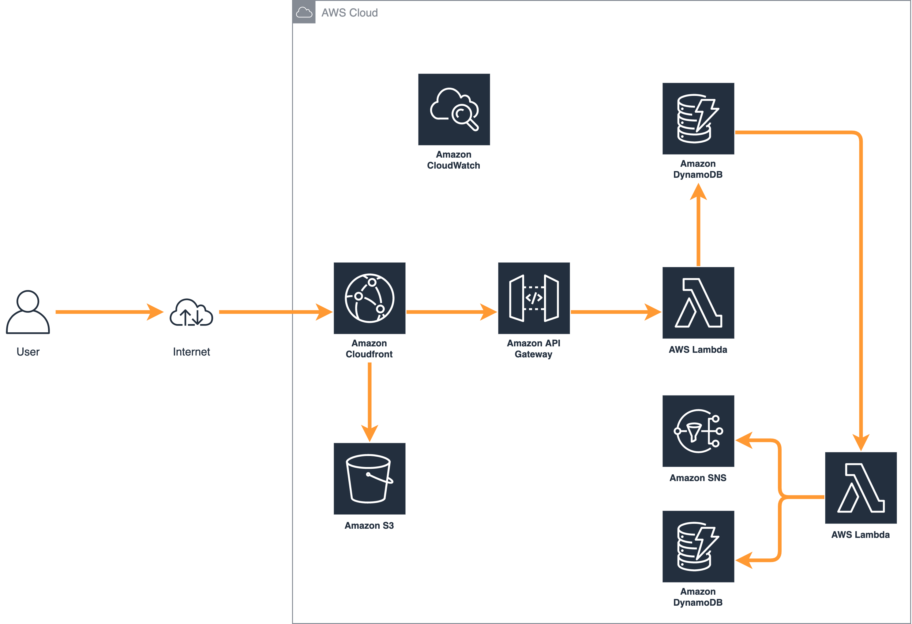

## Architecture

**End-to-end Architecture**

&nbsp;

**What is this App**

This web-app sends a random bible verse by entering a phone number. It was used by church members to receive a verse during a new year eve celebration. It is built using React web framework for user interface and Python for backend functions. 

**Frontend**

The contents and build artifacts of the website are stored in S3. Amazon CloudFront caches the frontend content from S3, serving the application to the user via an edge location.

**Backend**

The core of the backend infrastructure consists of Amazon DynamoDB, AWS Lambda, Amazon API Gateway and AWS SNS. A Lambda function stores phone numbers from API Gateway POST requests in to a DynamoDB table. A DynamoDB stream triggers another Lambda function to grab an item from a Verse table and send a text message using AWS SNS.

<!--  -->
